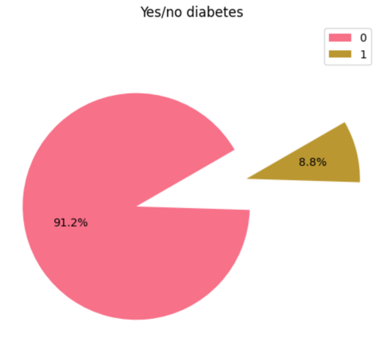
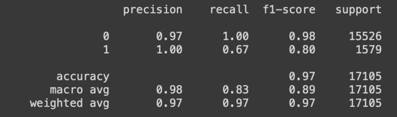
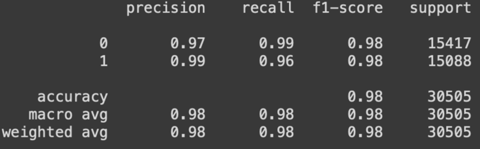

# Diabetes prediction model

## Dataset

[Diabetes prediction dataset](https://www.kaggle.com/datasets/iammustafatz/diabetes-prediction-dataset)

## Diabetes Exploratory Data Analysis

During EDA, we encoded categorical values, scaled numeric values, calculated correlation and identified the following
key features that contribute to the diabetes prediction:

* blood_glucose_level
* HbA1c_level
* age
* bmi

More details can be found
here: [diabetes_eda_and_backfill_feature_group.ipynb](diabetes_eda_and_backfill_feature_group.ipynb)

The initial dataset was significantly unbalanced:

So, we decided to use [YData Synthetic](https://github.com/ydataai/ydata-synthetic) to oversample the minority class.

We trained a CTGAN model and saved it to Hopsworks. We also generated new samples, which gave us a more balanced
dataset:

Besides, we added **data validation** by identifying a min-max range for our key features.

More details can be found
here: [v2_diabetes_eda_and_backfill_feature_group.ipynb](v2_diabetes_eda_and_backfill_feature_group.ipynb)

## Training

We testes KNeighborsClassifier, SGDClassifier, BernoulliNB, RandomForestClassifier and SVC. `RandomForestClassifier`
showed the best accuracy.

The overall accuracy on the imbalanced dataset was high. However, `recall` for diabetes prediction was relatively low.

With oversampling, we managed to improve the modal prediction for both classes:

Both models are saved to Hopsworks.

More details can be found
here: [diabetes_training_pipeline.ipynb](diabetes_training_pipeline.ipynb)

## Daily pipeline

We used YData model, that was initially trained for oversampling, to generate new daily records. The job is run on Modal
and saves 1000 records to Hopsworks feature store every day.

More details can be found
here: [diabetes-feature-pipeline-daily.py](diabetes-feature-pipeline-daily.py)